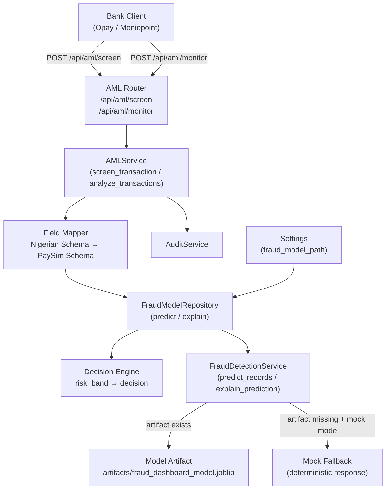

# Design Document: AML Fraud Screening

## Overview 

This feature integrates the `FraudDetectionService` ensemble ML model (XGBoost/HistGradientBoosting + IsolationForest) into the WeGoComply AML system. It introduces a real-time transaction screening endpoint (`POST /api/aml/screen`) and upgrades the existing batch monitoring endpoint (`POST /api/aml/monitor`) to use the same model.

The integration is structured as a thin adapter layer: a new `FraudModelRepository` wraps `FraudDetectionService`, a field-mapping layer translates between the Nigerian banking schema used by WeGoComply clients and the PaySim schema expected by the model, and a decision engine converts risk bands into actionable decisions (`APPROVED`, `DECLINED`, `REVIEW`).

The system supports a mock-mode fallback so developers can run the application locally without the training dataset or a pre-trained artifact.

---

## Architecture



The existing `AMLModelRepository` (IsolationForest) is retained for backward compatibility but is no longer the primary scoring engine. `AMLService` is extended with a `screen_transaction()` method and its `analyze_transactions()` method is upgraded to delegate scoring to `FraudModelRepository`.

---

## Components and Interfaces

### 1. `FraudDetectionService` (adapted copy)

**File:** `backend/services/fraud_detection_service.py`

A copy of `fraud_detection.py` adapted for the backend context:
- Import paths adjusted for the `backend/` package structure
- `ARTIFACT_PATH` reads from `Settings.fraud_model_path` rather than a hardcoded relative path
- No other behavioural changes; the class API is identical

**Key methods used by the rest of the system:**
```python
def predict_records(self, records: pd.DataFrame | list[dict]) -> pd.DataFrame
def explain_prediction(self, transaction: dict) -> list[str]
def load_or_train(self, force_retrain: bool = False, dataset_path: str | None = None) -> dict
```

### 2. `FraudModelRepository`

**File:** `backend/repositories/fraud_model_repository.py`

Wraps `FraudDetectionService` and exposes a simple dict-in / dict-out interface to the rest of the backend. Handles mock fallback when the artifact is missing.

```python
class FraudModelRepository:
    def __init__(self, settings: Settings) -> None: ...

    def predict(self, transaction_dict: dict) -> dict:
        """
        Accepts a single transaction in PaySim schema.
        Returns: {
            fraud_risk_score: float,
            risk_band: str,
            classifier_score: float,
            anomaly_score: float,
            predicted_is_fraud: int,
            mock: bool,
        }
        """

    def explain(self, transaction_dict: dict) -> list[str]:
        """
        Accepts a single transaction in PaySim schema.
        Returns a list of human-readable reason strings.
        """
```

**Mock fallback logic:**
- On initialisation, calls `FraudDetectionService.load_or_train()`.
- If the artifact file does not exist and `settings.mode == AppMode.MOCK`, logs a warning and sets an internal `_mock_mode` flag.
- When `_mock_mode` is active, `predict()` returns the deterministic mock response without calling the model.
- When `_mock_mode` is active, `explain()` returns `["Mock mode: model artifact not available"]`.

**Deterministic mock response:**
```python
{
    "fraud_risk_score": 0.1,
    "risk_band": "Low Risk",
    "classifier_score": 0.1,
    "anomaly_score": 0.1,
    "predicted_is_fraud": 0,
    "mock": True,
}
```

### 3. `FieldMapper`

**File:** Implemented as a module-level function in `backend/services/aml_service.py` (or a small helper module `backend/services/field_mapper.py`).

Translates a `ScreeningRequest` (Nigerian schema) into a PaySim-schema dict.

```python
def map_to_paysim(request: ScreeningRequest) -> dict:
    """
    Returns a dict with keys matching FraudDetectionService INPUT_COLUMNS:
    step, type, amount, oldbalanceOrg, newbalanceOrig,
    oldbalanceDest, newbalanceDest, isFlaggedFraud
    """
```

**Mapping rules:**

| Nigerian field | PaySim field | Rule |
|---|---|---|
| `transaction_type = "transfer"` | `type = "TRANSFER"` | Direct map |
| `transaction_type = "deposit"` | `type = "CASH_IN"` | Direct map |
| `transaction_type = "withdrawal"` | `type = "CASH_OUT"` | Direct map |
| `timestamp.hour` | `step` | Used when `step` not provided |
| `step` (if provided) | `step` | Used as-is |
| `old_balance_origin` | `oldbalanceOrg` | Default `0.0` |
| `new_balance_origin` | `newbalanceOrig` | Default `0.0` |
| `old_balance_destination` | `oldbalanceDest` | Default `0.0` |
| `new_balance_destination` | `newbalanceDest` | Default `0.0` |
| `is_flagged_fraud` | `isFlaggedFraud` | Default `0` |
| `amount` | `amount` | Direct pass-through |

### 4. `DecisionEngine`

**File:** Implemented as a module-level function in `backend/services/aml_service.py`.

```python
RISK_BAND_TO_DECISION: dict[str, str] = {
    "High Risk": "DECLINED",
    "Review":    "REVIEW",
    "Watch":     "APPROVED",
    "Low Risk":  "APPROVED",
}

def get_decision(risk_band: str) -> Literal["APPROVED", "DECLINED", "REVIEW"]:
    return RISK_BAND_TO_DECISION[risk_band]
```

### 5. `AMLService` extensions

**File:** `backend/services/aml_service.py`

New method added:
```python
def screen_transaction(self, request: ScreeningRequest) -> ScreeningResponse:
    paysim = map_to_paysim(request)
    prediction = self.fraud_repository.predict(paysim)
    reasons = self.fraud_repository.explain(paysim)
    decision = get_decision(prediction["risk_band"])
    return ScreeningResponse(
        transaction_id=request.transaction_id,
        decision=decision,
        fraud_risk_score=prediction["fraud_risk_score"],
        risk_band=prediction["risk_band"],
        reasons=reasons,
        classifier_score=prediction["classifier_score"],
        anomaly_score=prediction["anomaly_score"],
        mock=prediction.get("mock", False),
    )
```

`analyze_transactions()` is upgraded to call `self.fraud_repository.predict()` per transaction instead of the IsolationForest model, then applies the existing rule-based checks on top.

### 6. Schema extensions

**File:** `backend/schemas/aml.py`

Two new Pydantic models added:

```python
class ScreeningRequest(BaseSchema):
    transaction_id: str
    customer_id: str
    amount: float = Field(..., gt=0)
    currency: str = "NGN"
    timestamp: datetime
    transaction_type: Literal["transfer", "deposit", "withdrawal"]
    counterparty: str
    channel: Literal["mobile", "web", "pos", "atm"]
    # Optional PaySim balance fields
    old_balance_origin: float = Field(default=0.0, ge=0)
    new_balance_origin: float = Field(default=0.0, ge=0)
    old_balance_destination: float = Field(default=0.0, ge=0)
    new_balance_destination: float = Field(default=0.0, ge=0)
    is_flagged_fraud: int = Field(default=0, ge=0, le=1)
    step: int | None = None


class ScreeningResponse(BaseSchema):
    transaction_id: str
    decision: Literal["APPROVED", "DECLINED", "REVIEW"]
    fraud_risk_score: float
    risk_band: str
    reasons: list[str]
    classifier_score: float
    anomaly_score: float
    mock: bool = False
```

### 7. Router extension

**File:** `backend/routers/aml.py`

New endpoint added:
```python
@router.post("/screen", response_model=ScreeningResponse, responses=ERROR_RESPONSES)
async def screen_transaction(
    request: Request,
    screening_request: ScreeningRequest,
    current_user: AuthenticatedUser = Depends(
        require_roles(UserRole.ADMIN, UserRole.COMPLIANCE_OFFICER, UserRole.ANALYST)
    ),
    audit_service: AuditService = Depends(get_audit_service),
    service: AMLService = Depends(get_aml_service),
) -> ScreeningResponse: ...
```

### 8. Configuration

**File:** `backend/core/config.py`

New field added to `Settings`:
```python
fraud_model_path: Path
```

New resolver function (mirrors `_resolve_model_path`):
```python
def _resolve_fraud_model_path(raw_path: str | None) -> Path:
    if not raw_path:
        return (BASE_DIR.parent / "artifacts" / "fraud_dashboard_model.joblib").resolve()
    model_path = Path(raw_path)
    if model_path.is_absolute():
        return model_path
    return (BASE_DIR / model_path).resolve()
```

`FRAUD_MODEL_PATH` environment variable is read in `get_settings()`.

### 9. Dependency wiring

**File:** `backend/dependencies.py`

```python
@lru_cache
def get_fraud_model_repository() -> FraudModelRepository:
    return FraudModelRepository(get_settings())

@lru_cache
def get_aml_service() -> AMLService:
    return AMLService(get_settings(), get_aml_model_repository(), get_fraud_model_repository())
```

`AMLService.__init__` signature is extended to accept `fraud_repository: FraudModelRepository`.

---

## Data Models

### PaySim Schema (internal)

| Field | Type | Source |
|---|---|---|
| `step` | `int` | `request.step` or `request.timestamp.hour` |
| `type` | `str` | Mapped from `request.transaction_type` |
| `amount` | `float` | `request.amount` |
| `oldbalanceOrg` | `float` | `request.old_balance_origin` (default `0.0`) |
| `newbalanceOrig` | `float` | `request.new_balance_origin` (default `0.0`) |
| `oldbalanceDest` | `float` | `request.old_balance_destination` (default `0.0`) |
| `newbalanceDest` | `float` | `request.new_balance_destination` (default `0.0`) |
| `isFlaggedFraud` | `int` | `request.is_flagged_fraud` (default `0`) |

### Risk Band → Decision Mapping

| `risk_band` | `decision` | `risk_level` (batch) | `recommended_action` (batch) |
|---|---|---|---|
| `High Risk` | `DECLINED` | `HIGH` | `GENERATE_STR` |
| `Review` | `REVIEW` | `MEDIUM` | `REVIEW` |
| `Watch` | `APPROVED` | `MEDIUM` | `REVIEW` |
| `Low Risk` | `APPROVED` | — (clean) | — (clean) |

### Model Artifact Bundle (from `FraudDetectionService`)

The artifact is a `joblib`-serialised dict with keys: `artifact_version`, `classifier`, `anomaly_model`, `anomaly_scaler`, `feature_columns`, `threshold`, `anomaly_min`, `anomaly_max`, `metrics`, `profile`, `examples`.

---

## Correctness Properties

*A property is a characteristic or behavior that should hold true across all valid executions of a system — essentially, a formal statement about what the system should do. Properties serve as the bridge between human-readable specifications and machine-verifiable correctness guarantees.*

### Property 1: Screening response structure invariant

*For any* valid `ScreeningRequest`, the `screen_transaction()` method SHALL return a `ScreeningResponse` where `fraud_risk_score` is in `[0.0, 1.0]`, `decision` is one of `{"APPROVED", "DECLINED", "REVIEW"}`, `risk_band` is one of `{"High Risk", "Review", "Watch", "Low Risk"}`, and `reasons` is a non-empty list of strings.

**Validates: Requirements 1.2**

---

### Property 2: Decision engine exhaustive mapping

*For any* `risk_band` value produced by `FraudDetectionService` (`"High Risk"`, `"Review"`, `"Watch"`, `"Low Risk"`), the `get_decision()` function SHALL return `"DECLINED"` for `"High Risk"`, `"REVIEW"` for `"Review"`, and `"APPROVED"` for both `"Watch"` and `"Low Risk"`.

**Validates: Requirements 1.3, 1.4, 1.5**

---

### Property 3: Audit log entry on every screening call

*For any* valid `ScreeningRequest`, calling `screen_transaction()` SHALL result in exactly one call to `audit_service.log_action()` with `action="aml.screen_transaction"` and a `status` of either `"succeeded"` or `"failed"`.

**Validates: Requirements 1.8**

---

### Property 4: Transaction type mapping correctness and coverage

*For any* `transaction_type` value in `{"transfer", "deposit", "withdrawal"}`, `map_to_paysim()` SHALL produce a `type` value in `{"TRANSFER", "CASH_IN", "CASH_OUT"}` with the exact mapping: `transfer→TRANSFER`, `deposit→CASH_IN`, `withdrawal→CASH_OUT`.

**Validates: Requirements 2.1, 8.1**

---

### Property 5: Field mapping defaults

*For any* `ScreeningRequest` where balance fields and `step` are omitted, `map_to_paysim()` SHALL set `oldbalanceOrg`, `newbalanceOrig`, `oldbalanceDest`, `newbalanceDest` each to `0.0`, `isFlaggedFraud` to `0`, and `step` to `request.timestamp.hour`.

**Validates: Requirements 2.2, 2.3, 2.4**

---

### Property 6: Identity preservation of transaction_id and customer_id

*For any* `ScreeningRequest` with arbitrary `transaction_id` and `customer_id` strings, the `ScreeningResponse` SHALL contain the exact same `transaction_id` value without modification.

**Validates: Requirements 2.6**

---

### Property 7: Explicit step passthrough

*For any* `ScreeningRequest` where `step` is explicitly provided as an integer, `map_to_paysim()` SHALL use that exact integer value for the `step` field without modification or derivation from the timestamp.

**Validates: Requirements 7.3**

---

### Property 8: Balance field preservation

*For any* `ScreeningRequest` where balance fields are explicitly provided as floats, `map_to_paysim()` SHALL pass those exact float values to `FraudDetectionService` without rounding, clamping, or any transformation beyond type coercion to `float`.

**Validates: Requirements 8.3**

---

### Property 9: Mapping idempotence

*For any* `transaction_type` input, calling `map_to_paysim()` multiple times with the same input SHALL always produce the same `type` output regardless of call order or prior calls.

**Validates: Requirements 8.2**

---

### Property 10: Predict output structure

*For any* valid PaySim-schema dict passed to `FraudModelRepository.predict()`, the returned dict SHALL contain all five keys: `fraud_risk_score` (float in `[0,1]`), `risk_band` (one of the four valid bands), `classifier_score` (float in `[0,1]`), `anomaly_score` (float in `[0,1]`), and `predicted_is_fraud` (integer `0` or `1`).

**Validates: Requirements 3.1**

---

### Property 11: Explain output structure

*For any* valid PaySim-schema dict passed to `FraudModelRepository.explain()`, the returned value SHALL be a non-empty list of strings.

**Validates: Requirements 3.2**

---

### Property 12: Rule-based checks preserved in batch

*For any* transaction in a batch where `amount >= 5_000_000`, or `timestamp.hour < 5`, or (`transaction_type == "transfer"` and `amount > 1_000_000`), the corresponding `AMLFlaggedTransaction` in the batch response SHALL include the matching rule name (`LARGE_CASH_TRANSACTION`, `UNUSUAL_HOURS`, or `HIGH_VALUE_TRANSFER`) in `rules_triggered`.

**Validates: Requirements 3.5**

---

### Property 13: Mock fallback determinism

*For any* transaction input when `FraudModelRepository` is operating in mock fallback mode (artifact missing, `WEGOCOMPLY_MODE=mock`), `predict()` SHALL always return `fraud_risk_score=0.1`, `risk_band="Low Risk"`, `predicted_is_fraud=0`, and `mock=True`, regardless of the transaction's field values.

**Validates: Requirements 5.3, 5.5**

---

### Property 14: Batch anomaly_score population

*For any* batch of transactions processed by `analyze_transactions()`, each `AMLFlaggedTransaction` in the response SHALL have its `anomaly_score` field set to the `fraud_risk_score` value returned by `FraudModelRepository.predict()` for that transaction.

**Validates: Requirements 6.1**

---

### Property 15: Batch flagged/clean classification

*For any* batch of transactions, a transaction with `risk_band` of `"High Risk"` or `"Review"` SHALL appear in `flagged_transactions`, and a transaction with `risk_band` of `"Watch"` or `"Low Risk"` with no rules triggered SHALL be counted in `clean_count` and not appear in `flagged_transactions`.

**Validates: Requirements 6.2, 6.3**

---

### Property 16: Batch risk_level and recommended_action mapping

*For any* flagged transaction in a batch response, `risk_level` SHALL be `"HIGH"` when `risk_band` is `"High Risk"`, `"MEDIUM"` when `risk_band` is `"Review"` or `"Watch"`, and `recommended_action` SHALL be `"GENERATE_STR"` when `risk_level` is `"HIGH"` and `"REVIEW"` when `risk_level` is `"MEDIUM"`.

**Validates: Requirements 6.4, 6.5**

---

## Error Handling

### Input validation errors (422)

- `amount <= 0`: rejected by Pydantic `Field(..., gt=0)` on `ScreeningRequest`
- Negative balance fields: rejected by Pydantic `Field(default=0.0, ge=0)`
- `is_flagged_fraud` outside `{0, 1}`: rejected by Pydantic `Field(default=0, ge=0, le=1)`
- Unsupported `transaction_type`: rejected by Pydantic `Literal` constraint; `map_to_paysim()` raises `ValueError` for any value that slips through, which FastAPI converts to 422

### Model errors (500)

- If `FraudDetectionService.predict_records()` raises (e.g., malformed feature frame), `FraudModelRepository.predict()` propagates the exception. The router's existing `try/except` block logs the failure to the audit log and re-raises, resulting in a 500 response via the global exception handler.

### Artifact directory creation

- `FraudModelRepository.__init__()` calls `settings.fraud_model_path.parent.mkdir(parents=True, exist_ok=True)` before calling `load_or_train()`, ensuring the directory exists regardless of environment.

### Mock mode warning

- When mock fallback is activated, `FraudModelRepository` logs at `WARNING` level: `"[fraud-repo] Model artifact not found at {path}. Using deterministic mock predictions."` This appears in application logs but does not affect the response.

### Authentication and authorisation

- The `/api/aml/screen` endpoint uses the same `require_roles(ADMIN, COMPLIANCE_OFFICER, ANALYST)` guard as `/api/aml/monitor`. Unauthenticated requests return 401; unauthorised roles return 403.

---

## Testing Strategy

### Unit tests

Unit tests cover specific examples, edge cases, and error conditions:

- `test_field_mapper.py`: verify each `transaction_type` mapping, default values, step derivation, explicit step passthrough, balance preservation, unsupported type raises `ValueError`
- `test_decision_engine.py`: verify all four risk band → decision mappings
- `test_fraud_model_repository.py`: verify mock fallback response, verify `load_or_train()` is called on init, verify directory creation
- `test_aml_service_screen.py`: verify `screen_transaction()` wires field mapper + repository + decision engine correctly, verify audit log call
- `test_aml_service_batch.py`: verify `analyze_transactions()` uses `FraudModelRepository`, verify rule-based checks still fire, verify risk_level/recommended_action mapping
- `test_aml_router.py`: verify `/api/aml/screen` returns 401 for unauthenticated, 422 for invalid input, 200 for valid input

### Property-based tests

Property-based tests use **Hypothesis** (the standard Python PBT library). Each test runs a minimum of **100 iterations**.

Each test is tagged with a comment in the format:
`# Feature: aml-fraud-screening, Property {N}: {property_text}`

**Property tests to implement:**

| Property | Test file | Hypothesis strategy |
|---|---|---|
| P1: Response structure invariant | `test_pbt_screening.py` | `st.builds(ScreeningRequest, ...)` with random valid fields |
| P2: Decision engine exhaustive mapping | `test_pbt_decision_engine.py` | `st.sampled_from(["High Risk", "Review", "Watch", "Low Risk"])` |
| P3: Audit log on every call | `test_pbt_screening.py` | Random valid requests + mock audit service |
| P4: Transaction type mapping | `test_pbt_field_mapper.py` | `st.sampled_from(["transfer", "deposit", "withdrawal"])` |
| P5: Field mapping defaults | `test_pbt_field_mapper.py` | Requests with omitted optional fields |
| P6: ID preservation | `test_pbt_field_mapper.py` | `st.text()` for transaction_id/customer_id |
| P7: Explicit step passthrough | `test_pbt_field_mapper.py` | `st.integers(min_value=0, max_value=23)` for step |
| P8: Balance field preservation | `test_pbt_field_mapper.py` | `st.floats(min_value=0.0, allow_nan=False)` for balance fields |
| P9: Mapping idempotence | `test_pbt_field_mapper.py` | Call mapper twice with same input, compare outputs |
| P10: Predict output structure | `test_pbt_fraud_repository.py` | Random PaySim dicts with mocked FraudDetectionService |
| P11: Explain output structure | `test_pbt_fraud_repository.py` | Random PaySim dicts with mocked FraudDetectionService |
| P12: Rule-based checks preserved | `test_pbt_batch.py` | Generate transactions that trigger each rule |
| P13: Mock fallback determinism | `test_pbt_fraud_repository.py` | Random inputs, artifact absent, mock mode |
| P14: Batch anomaly_score population | `test_pbt_batch.py` | Random transaction batches with mocked repository |
| P15: Batch flagged/clean classification | `test_pbt_batch.py` | Random batches with controlled risk bands |
| P16: Batch risk mapping | `test_pbt_batch.py` | Random flagged transactions with controlled risk bands |

**Configuration:**
```python
from hypothesis import given, settings as hyp_settings, HealthCheck

@hyp_settings(max_examples=100, suppress_health_check=[HealthCheck.too_slow])
@given(...)
def test_property_N(...): ...
```

### Integration tests

- End-to-end test of `POST /api/aml/screen` with a real (or pre-trained artifact) model
- Verify response time is under 2000ms for a single transaction
- Verify mock mode returns `mock=true` in response body
- Verify `/api/aml/monitor` batch endpoint still works after upgrade
